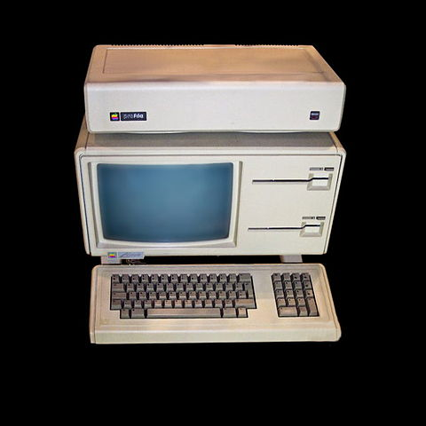
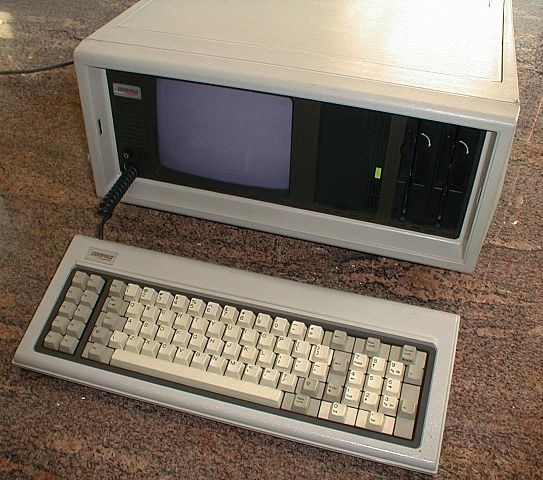

- title : Hints for Computer System Design
- description : While technologies, methodologies and abstractions have waxed and waned over the years, Butler Lampson’s ‘Hints for Computer Systems Design’ remains relevant to the current challenges faced in hardware and software  systems engineering.  Drawing against the backdrop of current development practices, we will discuss how Lampson’s hints can still be used, some thirty years later, to implement functionally accurate, high-performing fault-tolerant software systems.
- author : William Berry 
- theme : moon
- transition : default

***
"Science is about knowing; engineering is about doing." - Henry Petroski

---
"A good scientist is a person with original ideas. A good engineer is a person who makes a design that works with as few original ideas as possible." - Freeman Dyson

' the physicist/mathematician, no relation to the vacuum cleaners 

---
"Design is not what it looks like and feels like. Design is how it works." - Steve Jobs

---
"The walls between art and engineering exist only in our minds" - Theo Jansen

---
"[requirements, architecture, process, techniques]. Of course the goals are in conflict, and engineering is the art of making tradeoffs, for instance among features, speed, cost, dependability, and time to market." - Butler Lampson

***
Hints For Computer System Design
----------------------------------------
######- Butler Lampson (1983) -

Or ...  
How to Engineer Less Sucky Systems

' -2 take ways
' -Learn something, take tonight as an infection and spread it at work
' -We finish up & know all this. Explain why 30 years later 
' after time piled on abstractions, languages, architectures, technologies 
' there is still a timelessness to this work? 

***
###Industry Status - Hardware (1983)

Apple - Lisa 
Compaq - IBM clone 
Gavilan SC - "Laptop" 

' the year of ubiquitous compute 
' Compaq 53,000 PCs $111M first year sales same year went public 2nd year in biz

---

<figure style="display:inline-block;width:250px;">

<figcaption style="text-align:center;font-size:xx-small;display:table-caption;caption-side:bottom;width:225px;word-wrap: break-word;">"Apple Lisa". Licensed under CC BY-SA 3.0 via Wikimedia Commons - https://commons.wikimedia.org/wiki/File:Apple_Lisa.jpg#/media/File:Apple_Lisa.jpg</figcaption>
</figure>

<figure class="fragment" style="display:inline-block;width:250px;">

<figcaption style="text-align:center;font-size:xx-small;display:table-caption;caption-side:bottom;width:225px;word-wrap: break-word;">"Compaq portable". Licensed under Public Domain via Wikimedia Commons - https://commons.wikimedia.org/wiki/File:Compaq_portable.jpg#/media/File:Compaq_portable.jpg</figcaption>
</figure>

<figure class="fragment" style="display:inline-block;width:250px;">

<figcaption style="text-align:center;font-size:xx-small;display:table-caption;caption-side:bottom;width:225px;word-wrap: break-word;">"<a href="https://commons.wikimedia.org/wiki/File:Gavilan_SC.jpg#/media/File:Gavilan_SC.jpg">Gavilan SC</a>" by <a href="//commons.wikimedia.org/w/index.php?title=User:Rdc5&amp;action=edit&amp;redlink=1" class="new" title="User:Rdc5 (page does not exist)">Rdc5</a> - Own work. Licensed under <a href="http://www.gnu.org/copyleft/fdl.html" title="GNU Free Documentation License">GFDL</a> via <a href="https://commons.wikimedia.org/wiki/">Wikimedia Commons</a>.</figcaption>
</figure>

---
###Industry Status - Software/Networkings

Lotus 1-2-3 - Autocad - MS DOS 2.0 - Word

DNS - IEEE 802.3 - MIDI 

' Visicalc '79 - Xerox Star '81
' DNS by Paul Mockapetris @ UCI 
' IEEE 802.3 Physical Ethernet was approved as a standard

***
Road Map:

Fault Tolerance -> Speed -> Functionality

APIs & Microservices

' abstractions have been raised over the years
' processors -> memory/disk -> apps

<!---
****
*
* Fault Tolerance Section
*
****
--->

***
Fault Tolerance
==========

Reliability comes with Error Handling 
Reliability is not difficult, retrofitting reliability is 
Trade perfection for not falling down 

' Reliability is not difficult, retrofitting is.	
' Commented at application level which raises the question of who is the user? (APIs, Trading systems, etc.)

***
###End-to-End Error Handling

' Error handling between source and destination is about performance 
' End to end does lead directly to performance issues.

***
###Loggin'
Functional  
Immutable  
Captured State

' In memory, forced to disk, ensure its valid when flushed
' used all over the place, file systems, databases
' not all objects immutable so object versioning
' Bravo editor 2 update functions - Replace, Change (store version)

***
###Transactional Orientation
Make actions atomic or restartable. 
Idempotent  

' Transactions
' Idempotent 
' WAL vs Shadow paging - WAL in place using a log, shadow writes a whole new page then updates all refs.

<!---
****
*
* Speed Section
*
****
--->

***
Speed
=====

---
### Split Resources

' when this was written it was about memory and disk
' some times is faster to keep dedicated resources than shared, disk is cheap
' eg. no-sql, where we keep dedicated projections based on the questions of the application

---
### Use Static Analysis 

' that's it. just use it. 

---
### Cache Answers 

' Caching cache misses story

--- 
### What's the correct amount of RAM for my SQL box?

MORE

' point here is that cleverness can be easily surpassed by simple brute force. 
' tune sql and the queries or just have IT load more ram. 

---
### Background Workers & Batch Processing

' Lambda Architecture Batch and Speed Layers 

---
### Floatsam & Jetsam

' Load Shedding 

<!---
****
*
* Functionality
*
****
--->

***
Functionality
========
Composition 
Sufficiently Small & Fast 
Interface Design  

' simple, complete, small and fast implementation
' 

***
###KIS(S)
Do one thing really well 
Interfaces capture minimum requirements of an abstraction 
Don't generalize, generalizations are generally wrong 

' think about interfaces at each intersection of interaction 
' field/property -> method -> object -> factory -> controller -> service -> website -> user
' unintended consequences, login interface accidentally reveal user emails 

***
###Corollaries
Build basic interfaces that are blazing fast 
How do we know it's fast? Telemetry & Logging 
"... it is normal for 80% of the time to be spent in 20% of the code, but a priori analysis or intuition usually can’t find the 20% with any certainty." - Lampson 

' OData vs WebAPI

***
###Composability & Continuity
Keep basic interfaces stable 
Keep a place to stand 

' write lots of little programs and compose the parts you need 
' flexibility, extensibility
' Microservices?
' TimeZone 2007 Microsoft

***
###Making Implementations Work
Plan to throw one away 
Keep Secrets  
Divide and Conquer 
Use a Good Idea Again  
Handle all cases, split good & bad 

' prototype - you will get it wrong
' Change should be hidden behind interface.
' Hiding can lead to decreased performance 
' split up complex problems, bounded context DDD
' If the abstractions are good use them over again.
' Http!

***
### Summary 

' Levels of abstraction are raised
' hard part is the systems design

***
-Fin-
===
 
 
@williamberryiii
https://github.com/WilliamBerryiii/Hints4CSD
https://williamberryiii.github.io/Hints4CSD