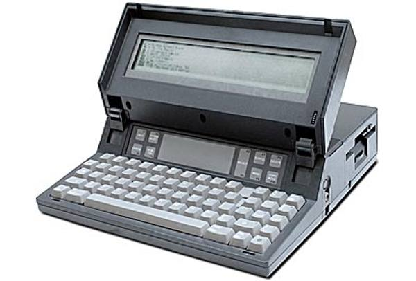

- title : Hints for Computer System Design
- description : While technologies, methodologies and abstractions have waxed and waned over the years, Butler Lampson’s ‘Hints for Computer Systems Design’ remains relevant to the current challenges faced in hardware and software  systems engineering.  Drawing against the backdrop of current development practices, we will discuss how Lampson’s hints can still be used, some thirty years later, to implement functionally accurate, high-performing fault-tolerant software systems.
- author : William Berry 
- theme : moon
- transition : default

***

&nbsp;

***
"Design is not what it looks like and feels like. Design is how it works." - Steve Jobs

---
"A good scientist is a person with original ideas. A good engineer is a person who makes a design that works with as few original ideas as possible." - Freeman Dyson

---
"Science is about knowing; engineering is about doing." - Henry Petroski

---
"The walls between art and engineering exist only in our minds" - Theo Jansen

---
"Of course the goals are in conflict, and engineering is the art of making tradeoffs, for instance among features, speed, cost, dependability, and time to market." - Butler Lampson

***
Hints For Computer System Design
----------------------------------------
######- Butler Lampson (1983) -

... or how to engineer less sucky systems

***
Hardware | Software	

Functionality -> Speed -> Fault Tolerance 

' top down approach

---
###Industry Status - Hardware

Apple - Lisa

Compaq - IBM clone

Gavilan SC - "Laptop" 

---

<figure style="display:inline-block;width:250px;">

<figcaption style="text-align:center;font-size:xx-small;display:table-caption;caption-side:bottom;width:225px;word-wrap: break-word;">"Apple Lisa". Licensed under CC BY-SA 3.0 via Wikimedia Commons - https://commons.wikimedia.org/wiki/File:Apple_Lisa.jpg#/media/File:Apple_Lisa.jpg</figcaption>
</figure>

<figure class="fragment" style="display:inline-block;width:250px;">

<figcaption style="text-align:center;font-size:xx-small;display:table-caption;caption-side:bottom;width:225px;word-wrap: break-word;">"Compaq portable". Licensed under Public Domain via Wikimedia Commons - https://commons.wikimedia.org/wiki/File:Compaq_portable.jpg#/media/File:Compaq_portable.jpg</figcaption>
</figure>

<figure class="fragment" style="display:inline-block;width:250px;">

<figcaption style="text-align:center;font-size:xx-small;display:table-caption;caption-side:bottom;width:225px;word-wrap: break-word;">"<a href="https://commons.wikimedia.org/wiki/File:Gavilan_SC.jpg#/media/File:Gavilan_SC.jpg">Gavilan SC</a>" by <a href="//commons.wikimedia.org/w/index.php?title=User:Rdc5&amp;action=edit&amp;redlink=1" class="new" title="User:Rdc5 (page does not exist)">Rdc5</a> - Own work. Licensed under <a href="http://www.gnu.org/copyleft/fdl.html" title="GNU Free Documentation License">GFDL</a> via <a href="https://commons.wikimedia.org/wiki/">Wikimedia Commons</a>.</figcaption>
</figure>

---
###Industry Status - Software/Networking

Lotus 1-2-3 - Autocad - MS DOS 2.0 - Word

DNS - GNU - IEEE 802.3 - Physical Ethernet - MIDI 

' Visicalc '79 - Xerox Star '81
' DNS by Paul Mockapetris @ UCI 
' Stallman GNU announced, did not start till 1984
' IEEE 802.3 was approved as a standard
' Mouse, Full Size Monitor, laser printer, 2 phase commit, ethernet

***
###But That Was Then ...

Hardware | Software | Peopleware

Fault Tolerance -> Speed -> Functionality

' and this is now
' start low level and build toward meta

<!---
****
*
* Fault Tolerance Section
*
****
--->

***
Fault Tolerance
==========

---
### End-to-End

---
### Log Updates

---
### Transactions

<!---
****
*
* Speed Section
*
****
--->

***
Speed
=====

---
### Split Resources

---
### Use Static Analysis 

---
### Cache Answers 

--- 
### What's the correct amount of RAM for my SQL box?

MORE

---
### Background Workers

---
### Batch Processing

---
### Safety First

---
### Shed Load

<!---
****
*
* Functionality
*
****
--->

***
Functionality
========

---
###KIS(S)

---
###Corollaries

---
###Continuity

---
###Making Implementations Work

***

